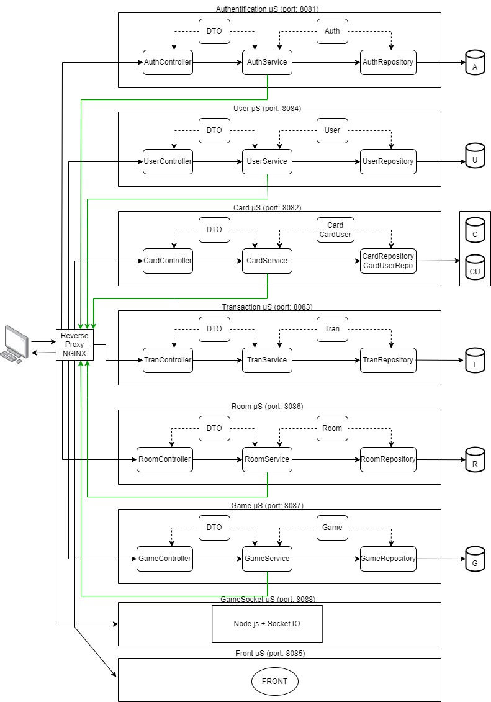

# Installation des bases de données

1. Assurez-vous d'avoir Docker installé sur votre machine
2. Récupérer le fichier docker-compose.yml à la racine du projet
3. Placez-vous dans même répertoire que le fichier et lancer la commande suivante:

```bash
docker-compose up
```

# Lancement des microservices et du reverse-proxy

1. Lancez les launchers java des microservices
2. Dans les répertoire front et gameSocket-microservice, lancer les commandes

```bash
npm install
npm start
```

3. Aller dans le répertoire reverse-proxy-nginx et lancer la commande

```bash
nginx
```

# Accès à l'application

Tapper **[http://localhost/](http://localhost)** dans votre navigateur

# Vidéo demo du site

[https://www.youtube.com/watch?v=nDXa3rvDG8o ](https://www.youtube.com/watch?v=nDXa3rvDG8o)

# Architecture


